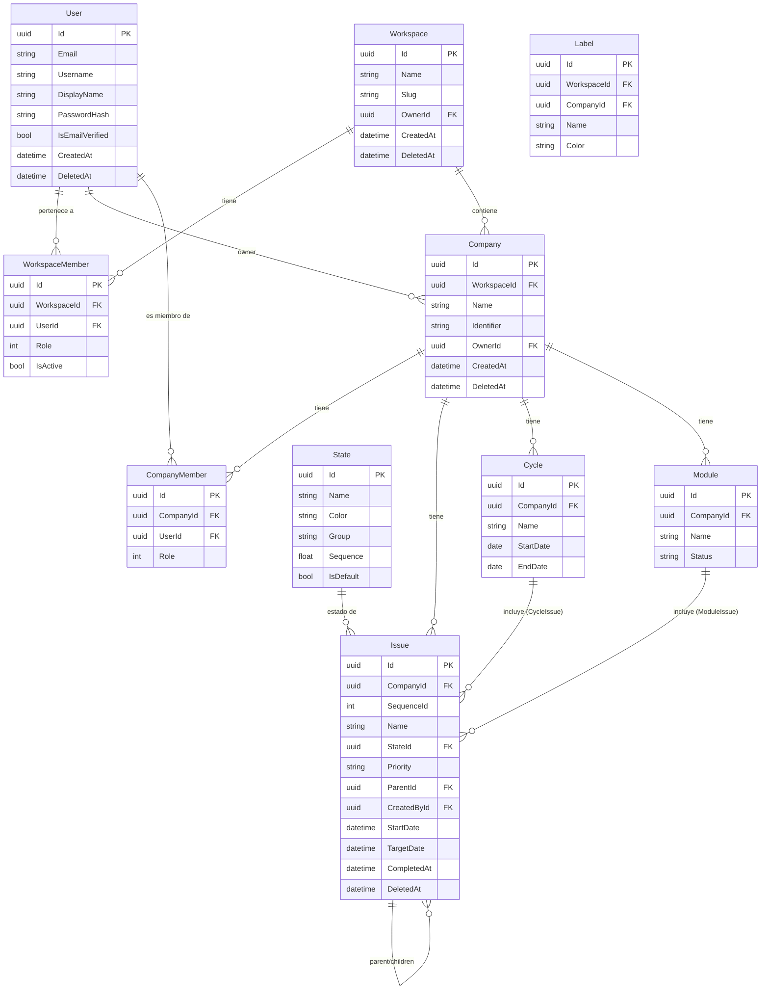

# Análisis: next-plane → TaskManager

## 1. Resumen ejecutivo

El proyecto en `/Users/edgardoruotolo/Sites/nextjs_projects/next-plane` **no es una app Next.js**. Es el monorepo open-source de **Plane** (clon de `github.com/makeplane/plane`), gestionado con Turborepo + pnpm workspaces. El frontend usa **React Router v7 + Vite** y el backend es **Django REST Framework + PostgreSQL**.

La adaptación al stack de TaskManager implica reemplazar Django por **ASP.NET Core Web API (.NET 9)** y conservar el frontend React+Vite, migrando el estado de MobX a Zustand y eliminando el modo framework de React Router para una SPA pura.

---

## 2. Stack del proyecto fuente

| Capa | Tecnología |
|---|---|
| Frontend | React Router v7 (framework mode, file-based routing) + Vite |
| State management | MobX + mobx-react |
| Data fetching | SWR + axios |
| UI | TailwindCSS + paquete propio `@plane/ui` (Headless UI) |
| Forms | react-hook-form (sin Zod) |
| Tables | @tanstack/react-table |
| Drag & drop | @atlaskit/pragmatic-drag-and-drop |
| Editor rich-text | `@plane/editor` (TipTap-based) |
| Backend | Python / Django REST Framework |
| ORM | Django ORM nativo (sin Prisma) |
| DB | PostgreSQL |
| Cola de tareas | Celery + Redis |
| Auth | Django sessions + OAuth (GitHub, GitLab, Google) |
| Monorepo | Turborepo + pnpm workspaces |

---

## 3. Modelo de datos original

### Entidades incluidas en TaskManager

#### Auth
- **`User`** — UUID PK, email único, username, display_name, first/last_name, avatar, is_email_verified, is_active, last_login_at, password_hash
- **`Profile`** — preferencias de usuario: tema, idioma, onboarding, start_of_week
- **`Account`** — conexiones OAuth (provider, access_token, refresh_token, FK User)
- **`Session`** — sesiones activas (token, device, ip, FK User)
- **`SocialLoginConnection`** — link entre User y providers externos

#### Workspace (Tenant)
- **`Workspace`** — name, slug único global, logo, owner FK User, timezone
- **`WorkspaceMember`** — workspace FK, user FK, role (20=Admin/15=Member/5=Guest), is_active, view_props JSON
- **`WorkspaceMemberInvite`** — email, token, role, accepted, workspace FK

#### Company (= Project en Plane)
- **`Company`** — workspace FK, name, identifier (prefijo p.ej. "ACME"), description, owner FK, network (0=Private/2=Public), default_state FK, timezone, cover_image, archived_at
- **`CompanyMember`** — company FK, user FK, role (20/15/5)
- **`CompanyIdentifier`** — 1:1 con Company, garantiza unicidad del identifier por workspace

#### States (Globales del sistema — adaptación)
- **`State`** — name, color, group enum (`Backlog/Unstarted/Started/Completed/Cancelled`), sequence float, is_default
- **Decisión de adaptación**: en Plane los states son **por proyecto**. En TaskManager serán **globales del sistema**, sin FK a Workspace ni Company.
- Los 6 estados default del sistema: `Backlog`, `Todo`, `In Progress`, `In Review`, `Done`, `Cancelled`

#### IssueType
- **`IssueType`** — workspace FK, name, is_epic, is_default, level
- **`CompanyIssueType`** — M2M entre IssueType y Company

#### Issues
- **`Issue`** — company FK, sequence_id (por empresa con advisory lock), name, description (json+html+stripped), state FK, priority (urgent/high/medium/low/none), parent self FK, start_date, target_date, completed_at, created_by FK, is_draft, archived_at
- **`IssueAssignee`** — M2M Issue ↔ User
- **`IssueLabel`** — M2M Issue ↔ Label
- **`IssueLink`** — url, title, FK Issue
- **`IssueRelation`** — issue FK, related_issue FK, relation_type (duplicate_of/blocked_by/blocking/is_epic_of)
- **`IssueSubscriber`** — M2M Issue ↔ User
- **`IssueComment`** — issue FK, actor FK, comment_json/html, external_source/id
- **`CommentReaction`** — comment FK, actor FK, reaction (emoji)
- **`IssueReaction`** — issue FK, actor FK, reaction (emoji)
- **`IssueActivity`** — log de cambios: issue FK, actor FK, verb, field, old/new_value, old/new_identifier
- **`IssueVersion`** — versiones del issue (owned_by, last_saved_at, description_json)

#### Cycles (Sprints)
- **`Cycle`** — company FK, name, description, start_date, end_date, owned_by FK, progress_snapshot JSON, archived_at
- **`CycleIssue`** — M2M Cycle ↔ Issue
- **`CycleUserProperties`** — display/filter preferences por usuario por cycle

#### Modules (Agrupaciones temáticas)
- **`Module`** — company FK, name, description, status enum (`backlog/planned/in-progress/paused/completed/cancelled`), lead FK, start_date, target_date, archived_at
- **`ModuleIssue`** — M2M Module ↔ Issue
- **`ModuleMember`** — M2M Module ↔ User
- **`ModuleLink`** — url, title, FK Module
- **`ModuleUserProperties`** — display/filter preferences por usuario por module

#### Labels
- **`Label`** — workspace FK, company FK opcional (label puede ser de workspace o de empresa), name, color, parent self FK (jerarquía)

#### Estimates
- **`Estimate`** — company FK, name, description, type (points/categories/time)
- **`EstimatePoint`** — estimate FK, key, value, description

#### Views (Vistas guardadas)
- **`IssueView`** — company FK, name, description, filters JSON, is_global

#### Notifications
- **`Notification`** — workspace FK, receiver FK, actor FK, entity_type, entity_identifier, title, message, data JSON, read_at, archived_at
- **`UserNotificationPreference`** — user FK, notification_type, property, individual_emails, email

#### Webhooks
- **`Webhook`** — workspace FK, url, secret_token, is_active, events (issues/cycles/modules/members), logs
- **`WebhookLog`** — webhook FK, request/response data, status

#### File Assets
- **`FileAsset`** — workspace FK, entity_type, entity_id, asset (path), size, is_deleted, storage_metadata JSON

#### API Tokens
- **`APIToken`** — user FK, workspace FK, label, description, token, is_service_token, expired_at
- **`APIActivityLog`** — token FK, path, method, ip, user_agent, response_code

---

### Entidades excluidas (evaluadas y descartadas)

| Entidad | Razón |
|---|---|
| `Page`, `PageVersion`, `PageLog` | Feature de wiki/docs eliminada por decisión de negocio |
| `ProjectPage` (M2M Page ↔ Project) | Eliminada junto con Pages |
| `PageLabel` | Eliminada junto con Pages |
| `Intake` / `IntakeIssue` | Triage queue — fuera de alcance de fase inicial |
| `RecurringIssueTemplate` + runs | Issues recurrentes — fuera de alcance |
| `DraftIssue` | Simplificado: usar `is_draft` en Issue directamente |
| `Sticky` | Post-its de usuario — no relevante |
| `DeployBoard` | Publicación pública de proyectos — no relevante |
| `Team` | Sub-equipos en workspace — fuera de alcance |
| Integraciones (GitHub, Slack, GitLab) | Fuera de alcance |
| `Importer` / `ExporterHistory` | Fuera de alcance |
| `AnalyticView` | Fuera de alcance |

---

## 4. Stack de TaskManager (frontend)

| Capa | Tecnología | Nota |
|---|---|---|
| Framework | Vite + React 19 + TypeScript strict | SPA pura, sin SSR |
| Routing | React Router DOM v7 | Modo SPA, sin loaders/actions de framework |
| State management | Zustand | Reemplaza MobX del original |
| Data fetching | TanStack Query + axios | Reemplaza SWR |
| Forms | React Hook Form + Zod | Introduce Zod (el original no lo usa) |
| UI components | **shadcn/ui** | Base de todos los componentes de interfaz |
| Notificaciones toast | **Sonner** | `<Toaster />` en root layout |
| Estilos | TailwindCSS 4 | Configuración vía `@import "tailwindcss"` |
| Iconos | Lucide React | — |
| Tables | TanStack Table | — |
| Drag & drop | @atlaskit/pragmatic-drag-and-drop | Kanban (fase posterior) |
| Linter | Biome | Reemplaza ESLint |
| Formatter | Prettier | — |
| Email transaccional | **Brevo** (API REST / SDK .NET) | Integración en el **backend**, no en frontend |

### Arquitectura DDD en el frontend

La estructura de carpetas del frontend sigue **Domain-Driven Design** con capas internas por módulo:

```
frontend/src/
├── modules/
│   └── [dominio]/
│       ├── domain/           — entidades, value objects, interfaces de repositorio
│       ├── application/      — casos de uso, stores Zustand, DTOs
│       ├── infrastructure/   — implementaciones axios (repositorios concretos)
│       └── presentation/     — componentes React, páginas, hooks de UI
└── shared/                   — shared kernel
    ├── components/ui/        — shadcn/ui
    ├── components/           — componentes genéricos
    ├── lib/                  — api-client axios, query-client
    ├── hooks/                — hooks transversales
    ├── schemas/              — Zod base (paginación, error)
    └── types/                — tipos compartidos entre módulos
```

**Reglas de dependencia (estrictas):**
- `domain/` → no importa nada de `infrastructure/` ni `presentation/`
- `application/` → solo importa de `domain/`
- `presentation/` → solo llama a `application/`, nunca a `infrastructure/` directamente
- Los stores Zustand (en `application/`) son el puente entre dominio y UI

**Módulos definidos:**

| Módulo | Dominio |
|---|---|
| `auth` | Autenticación, sesión, perfil |
| `workspaces` | Workspaces (tenant), membresías |
| `companies` | Empresas (ex-Projects), membresías |
| `states` | Estados globales del sistema |
| `issues` | Issues, asignaciones, comentarios, actividad |
| `cycles` | Ciclos / sprints |
| `modules` | Módulos temáticos |
| `labels` | Labels de workspace/empresa |

---

## 5. Decisiones de adaptación al stack TaskManager

### 4.1 Naming

| Plane | TaskManager | Motivo |
|---|---|---|
| `Project` | `Company` | Refleja el dominio de negocio real |
| `ProjectMember` | `CompanyMember` | Idem |
| `ProjectIdentifier` | `CompanyIdentifier` | Idem |

### 4.2 Estados globales del sistema

En Plane los estados son **por proyecto** (FK `project`). En TaskManager serán **globales del sistema**: una única tabla `State` sin FK a workspace ni empresa. El admin del sistema gestiona los estados disponibles para todos.

### 4.3 Soft delete

Plane usa `deleted_at` timestamp + `DeletedMixin`. En TaskManager: columnas `IsDeleted bool` + `DeletedAt datetime?` con **global query filter en EF Core** para que todas las queries excluyan registros eliminados automáticamente.

### 4.4 Sequence de Issues por empresa

Plane usa `pg_advisory_xact_lock` en PostgreSQL para generar `sequence_id` único y secuencial por proyecto (ISS-1, ISS-2…). En TaskManager se mantiene el mismo patrón usando `NpgsqlConnection` con advisory locks desde .NET.

### 4.5 JSON fields

Plane usa `JSONField` de Django ampliamente (filters, display_filters, view_props, progress_snapshot, logo_props). En TaskManager: columnas `jsonb` en PostgreSQL mapeadas con `JsonDocument` o POCOs serializables en EF Core 9.

### 4.6 Autenticación

Plane usa Django sessions + OAuth (GitHub, GitLab, Gitea, Google). En TaskManager: ASP.NET Core Identity + cookie auth. Las mismas tablas conceptuales (`User`, `Account`, `Session`) se mantienen, adaptadas a Identity.

### 4.7 Validación

Plane no usa Zod en el frontend (valida con react-hook-form + Django serializers). En TaskManager: **Zod** en frontend + **FluentValidation** en backend.

### 4.8 State management frontend

Plane usa **MobX**. TaskManager usará **Zustand** (más simple, sin decoradores, sin boilerplate).

---

## 6. Mapping tabla a tabla

| Tabla Plane | Tabla TaskManager | Cambios |
|---|---|---|
| `users` | `Users` | Igual, adaptado a ASP.NET Identity |
| `user_profiles` | `UserProfiles` | Igual |
| `accounts` (OAuth) | `Accounts` | Igual |
| `sessions` | `Sessions` | Igual |
| `workspaces` | `Workspaces` | Igual |
| `workspace_members` | `WorkspaceMembers` | Igual |
| `workspace_member_invites` | `WorkspaceMemberInvites` | Igual |
| `projects` | `Companies` | Renombrado |
| `project_members` | `CompanyMembers` | Renombrado |
| `project_identifiers` | `CompanyIdentifiers` | Renombrado |
| `states` | `States` | **Drop FK project** → global |
| `issue_types` | `IssueTypes` | Workspace-level, sin cambios |
| `project_issue_types` | `CompanyIssueTypes` | Renombrado |
| `issues` | `Issues` | `project_id` → `company_id` |
| `issue_assignees` | `IssueAssignees` | Igual |
| `issue_labels` | `IssueLabels` | Igual |
| `issue_links` | `IssueLinks` | Igual |
| `issue_relations` | `IssueRelations` | Igual |
| `issue_subscribers` | `IssueSubscribers` | Igual |
| `issue_comments` | `IssueComments` | Igual |
| `comment_reactions` | `CommentReactions` | Igual |
| `issue_reactions` | `IssueReactions` | Igual |
| `issue_activities` | `IssueActivities` | Igual |
| `issue_versions` | `IssueVersions` | Igual |
| `cycles` | `Cycles` | `project_id` → `company_id` |
| `cycle_issues` | `CycleIssues` | Igual |
| `modules` | `Modules` | `project_id` → `company_id` |
| `module_issues` | `ModuleIssues` | Igual |
| `module_members` | `ModuleMembers` | Igual |
| `module_links` | `ModuleLinks` | Igual |
| `labels` | `Labels` | Igual |
| `estimates` | `Estimates` | `project_id` → `company_id` |
| `estimate_points` | `EstimatePoints` | Igual |
| `issue_views` | `IssueViews` | `project_id` → `company_id` |
| `notifications` | `Notifications` | Igual |
| `user_notification_preferences` | `UserNotificationPreferences` | Igual |
| `webhooks` | `Webhooks` | Igual |
| `webhook_logs` | `WebhookLogs` | Igual |
| `file_assets` | `FileAssets` | Igual |
| `api_tokens` | `ApiTokens` | Igual |
| `api_activity_logs` | `ApiActivityLogs` | Igual |
| `pages`, `page_versions`, `page_logs`, `project_pages`, `page_labels` | ❌ Eliminadas | Feature descartada |

---

## 7. Diagrama ERD (Mermaid)



---

## 8. Seeding inicial

### Estados globales del sistema

Al arrancar con la tabla `States` vacía, el backend inserta los 6 estados default:

| Nombre | Color | Grupo | IsDefault |
|---|---|---|---|
| Backlog | `#94a3b8` | Backlog | No |
| Todo | `#64748b` | Unstarted | **Sí** |
| In Progress | `#3b82f6` | Started | No |
| In Review | `#f59e0b` | Started | No |
| Done | `#22c55e` | Completed | No |
| Cancelled | `#ef4444` | Cancelled | No |

### Usuario administrador global

Al arrancar con la tabla `Users` vacía, el backend crea un usuario admin leyendo variables de entorno desde `.env`:

| Variable | Valor de ejemplo |
|---|---|
| `ADMIN_USERNAME` | `eruotolo` |
| `ADMIN_EMAIL` | `eruotolo@fluentoc.com` |
| `ADMIN_PASSWORD` | *(hasheada, nunca en texto plano)* |
| `ADMIN_FIRST_NAME` | `Edgardo` |
| `ADMIN_LAST_NAME` | `Ruotolo` |

**Comportamiento:**
- Ejecuta solo si `Users` está vacía.
- Rol: administrador global (no pertenece a ningún workspace).
- Si alguna variable `ADMIN_*` está vacía al arrancar → error explícito (fail-fast).

---

## 9. Roadmap de implementación (fases)

### Fase 1 — Núcleo (Auth + Workspace + Company + State + Issue)
- Entidades: `User`, `Workspace`, `WorkspaceMember`, `Company`, `CompanyMember`, `State`, `Issue`
- Endpoints REST CRUD completos
- Auth: registro, login, sesión cookie, middleware de autenticación
- Seeder de 6 estados default
- Frontend: routing, auth store, workspace store, company list/detail, issue list con Kanban y List view

### Fase 2 — Ciclos, Módulos, Labels y Estimates
- Entidades: `Cycle`, `CycleIssue`, `Module`, `ModuleIssue`, `ModuleMember`, `ModuleLink`, `Label`, `Estimate`, `EstimatePoint`
- Endpoints REST + UI correspondiente

### Fase 3 — Actividad y colaboración
- Entidades: `IssueComment`, `CommentReaction`, `IssueReaction`, `IssueActivity`, `IssueVersion`, `IssueSubscriber`, `IssueLink`, `IssueRelation`
- Activity log automático en cada cambio de Issue

### Fase 4 — Vistas, Notificaciones, Webhooks y Assets
- Entidades: `IssueView`, `Notification`, `UserNotificationPreference`, `Webhook`, `WebhookLog`, `FileAsset`
- API de filtros y vistas guardadas

### Fase 5 — API Tokens, IssueTypes y avanzados
- Entidades: `IssueType`, `CompanyIssueType`, `APIToken`, `APIActivityLog`
- Generación y validación de tokens
- Soporte OAuth (GitHub, Google)

### Fuera de roadmap (por ahora)
- Pages / wiki
- Intake / triage queue
- Issues recurrentes
- Integraciones (GitHub, Slack)
- Importer / Exporter
- Analytics avanzado
- Editor rich-text (TipTap)
